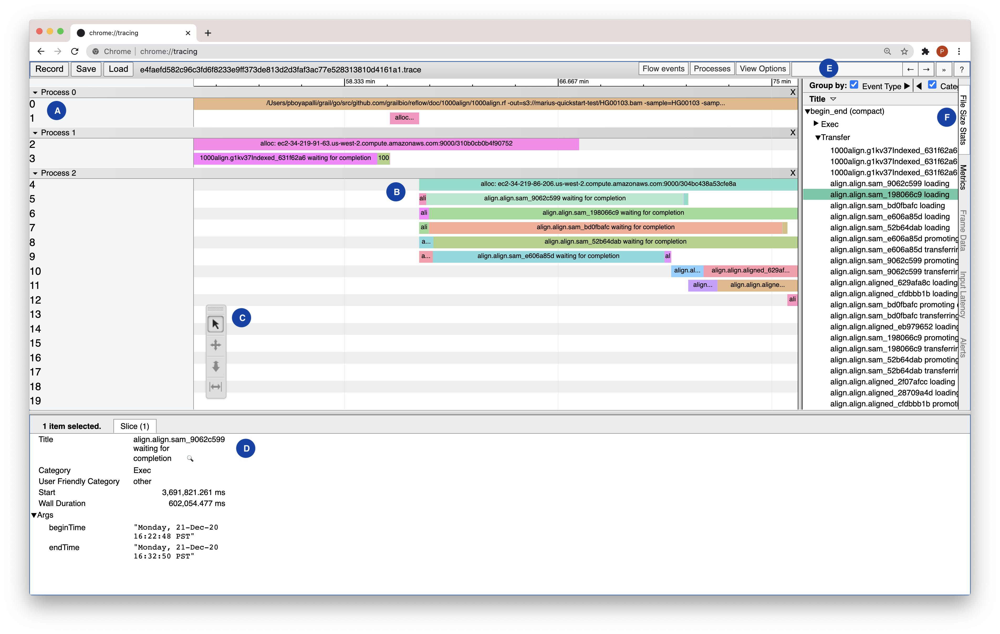
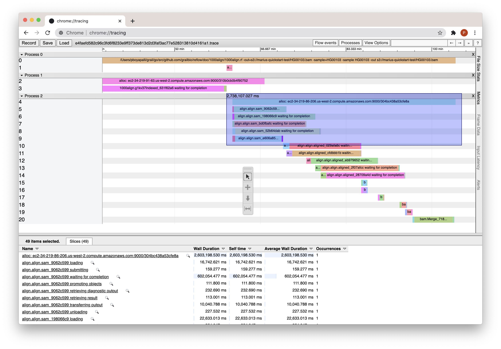
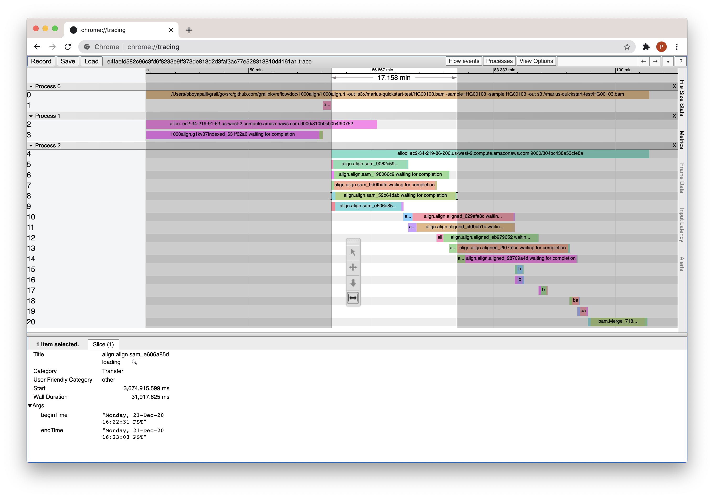

# Tracing Reflow Runs

**Contents**

- [Generate a trace for your run](#generate-a-trace-for-your-run)
- [Visualize a trace](#visualizing-a-trace)
  - [Overview](#overview)
  - [Tool Palette](#tool-palette)
  - [Span Categories](#span-categories)
  - [States](#states)

## Generate a trace for your run

To enable tracing for your run, specify the `-tracer=localtracer` flag:

    % reflow -tracer=localtracer run myprogram.rf 

When the run finishes, a `<runid>.trace` file will be written to 
`$HOME/.reflow/runs`.

## Visualize a trace

The generated trace files can be viewed using Google Chrome's built-in trace
viewer at: `chrome://tracing/`. Use the `Load` button to select the
`$HOME/.reflow/runs/<reflow run id>.trace` file to view the visualization.

The following sections explain the trace produced by Reflow and highlight some
useful features of the trace viewer. The trace used in the below examples was
generated by running the `1000align.rf` program from the project README.

### Overview

**(A)** Spans grouped under `Process 0` are top level items associated with the
overall run. The first row will always be the reflow program that is being run.
The next row will contain spans indicating time spent in allocating resources.
Clicking on one of these space will display more info in the bottom panel,
including the ID of what was allocated.

**(B)** Each subsequent process (`Process 1`, `Process 2`, etc) contains spans
which are associated with a specific `alloc`. For example, the execs grouped
under `Process 2` were run on alloc
`ec2-34-219-86-206.us-west-2.compute.amazonaws.com:9000/304bc438a53cfe8a`.

**(C)** The tool palette, from top to bottom: selection, pan, zoom, timing. See
the [Tool Palette](#tool-palette) section for usage information.

**(D)** When a span is selected, additional attributes will be displayed in the
bottom panel. See [Span Categories](#span-categories) for more info about
the `Category` field and [States](#states) which explains some info in
the `Title`.

**(E)** Use the search bar to highlight only the spans matching your query. For
example, you could search for a value name from your program (`g1kv37Indexed`)
or a flow ID from the logs (`52b64dab`).

**(F)** The `File Size Stats` button will toggle a sidebar which lists the spans
grouped by their `Category`.

### Tool Palette

From top to bottom, the tools are: selection, pan, zoom, timing.

**Selection**

This tool allows you to click and drag to select multiple spans and view 
aggregated data about them in the bottom panel.

**Pan**

Click and drag to navigate around the timeline.

**Zoom**

Hold down the mouse button and drag vertically to zoom in/out on the timeline.

**Timing**

The timing tool allows you to get exact time durations for one or more spans in
seconds/minutes/hours as appropriate. Click and drag to create the timing
interval; the duration will be shown near the top. The boundaries of the timing
interval will "snap" to the span boundaries, making it easy to get precise
timing.

### Span Categories

The span categories are constants defined in `reflow/trace/trace.go`.

- **Run:** the top level reflow run
- **Exec:** the execution of an `exec` clause in your Reflow program
- **Cache:** indicates a cache operation
- **Transfer:** indicates a transfer operation, i.e. loading and unloading data on the alloc
- **AllocReq:** indicates time spent allocating resources
- **AllocLifespan:** indicates the lifespan of the alloc

### States

Most span names (i.e. the `Title` field) contain a state from the below list.
These states are defined in `reflow/sched/scheduler.go` and are mostly for
internal use, but a few of
them may give you a better idea of what's going on in your program when
analyzing a trace.

- **loading:** data is being loaded onto the alloc for use by the exec
- **submitting:** the scheduler is submitting a task to alloc for execution
- **waiting for completion:** the user's `exec` is running, and the scheduler is
  awaiting its completion
- **verifying integrity:** the checksum of files used in the `exec` are verified
- **promoting objects:** promotes the objects in the `exec` repository to the
  alloc repository
- **retrieving diagnostic output**
- **retrieving result**
- **transferring output**
- **unloading** 
- **complete**
